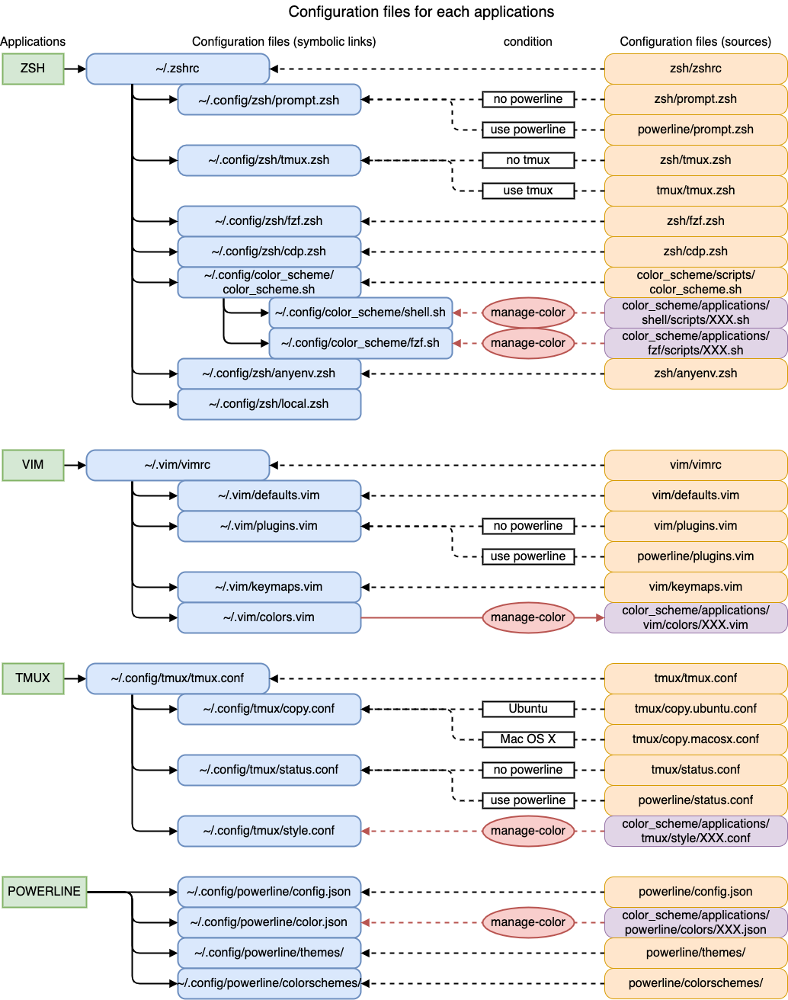

# dotfiles

preferences of zsh, vim, ...

## Contents

When installing for the first time, it is recommended to install and configure in the order listed below.

1. installation of fonts
    * go to [fonts](/fonts/)
1. installation of the management tool and required applications
    * choose one (the above is recommended)
    * go to [mise](/mise/)
    * go to [asdf](/asdf/)
1. installation and configuration of zsh
    * go to [zsh](/zsh/)
1. installation and configuration of vim
    * go to [vim](/vim/)
1. installation and configuration of terminal multiplexer
    * choose one (the above is recommended)
    * go to [tmux](/tmux/)
    * go to [herdr](/herdr/)
1. installation and configuration of powerline
    * go to [powerline](/powerline/)
1. installation and configuration of color scheme
    * go to [color_scheme](/color_scheme/)

