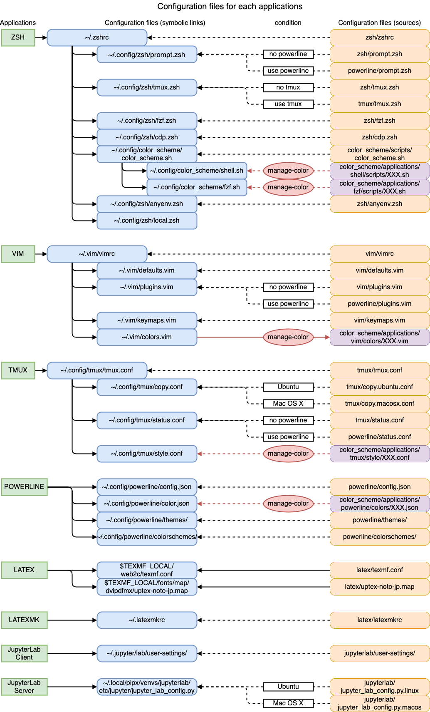

# dotfiles

preferences of zsh, vim, ...

## Contents

When installing for the first time, it is recommended to install and configure in the order listed below.

1. installation of fonts
    * go to [fonts](/fonts/)
1. installation and configuration of zsh
    * go to [zsh](/zsh/)
1. installation and configuration of vim
    * go to [vim](/vim/)
1. installation and configuration of tmux
    * go to [tmux](/tmux/)
1. installation and configuration of powerline
    * go to [powerline](/powerline/)
1. installation and configuration of color scheme
    * go to [color_scheme](/color_scheme/)
1. installation and configuration of LaTeX
    * go to [latex](/latex/)
1. installation and configuration of JupyterLab
    * go to [jupyterlab](/jupyterlab/)
1. installation of gnome-terminal config tool
    * go to [gnome_terminal](/gnome_terminal/)

