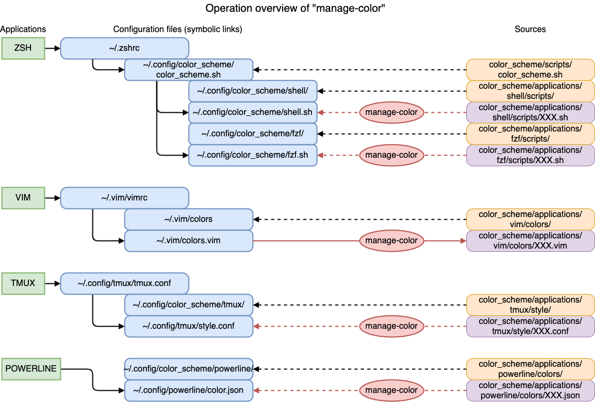
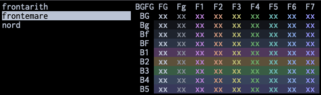

# color scheme

color schemes for zsh, vim, tmux and powerline.
and its configuration tool.

## Necessities

* pipx
    * pipx in installed in [zsh](/zsh/)

## What this does

* create symbolic link of zsh (bash) script to read color configs for shell and fzf
    * `scripts/color_scheme.sh` -> `~/.config/color_scheme/color_scheme.sh`
* create symbolic link of directory which contains color configs for shell
    * `applications/shell/scripts` -> `~/.config/color_scheme/shell`
* create symbolic link of directory which contains color configs for fzf
    * `applications/fzf/scripts` -> `~/.config/color_scheme/fzf`
* create symbolic link of directory which contains color configs for vim
    * `applications/vim/colors` -> `~/.vim/colors`
* create symbolic link of directory which contains color configs for tmux
    * `applications/tmux/style` -> `~/.config/color_scheme/tmux`
* create symbolic link of directory which contains color configs for powerline
    * `applications/powerline/colors` -> `~/.config/color_scheme/powerline`
* install color management application with pipx
    * `manage-color`

## What to do

* `> ./install.sh`

## Operation overview of "manage-color"

* color configuration files for each application has been created under each directory
    * that directory contains color configuration file of each color scheme
    * shell -> `applications/shell/scripts/`
    * fzf -> `applications/fzf/scripts/`
    * vim -> `applications/vim/colors/`
    * tmux -> `applications/tmux/style/`
    * powerline -> `applications/powerline/colors/`
* "manage-color" overwrites symbolic links of config file of each application
    * choose a color scheme in "manage-color"
    * "manage-color" overwrites symbolic links with chosen color scheme
    * (Exception) "manage-color" overwrites the contents of `~/.vim/colors.vim`

## How to operate "manage-color"

* `j`: move down
* `k`: move up
* `[return]`: choose

## How to add a color scheme

* create color scheme file -> see [schemes](/color_scheme/schemes/)
* add scheme group name to `sources.yaml` -> see [schemes](/color_scheme/schemes/)
* `> ./builder.py`
    * `> ./cleaner.py` removes all files `builder.py` created

## the files "builder.py" creates

* `applications/analysis/analysys/XXX.md`
    * Markdown for each color (hex, rgb (0-255), hsv (0-255))
* `applications/fzf/scripts/XXX.sh`
    * shell script which defines color of fzf
* `applications/iterm2/itermcolors/XXX.itermcolors`
    * iTerm2 configuration file
* `applications/powerline/colors/XXX.json`
    * powerline color json file
* `applications/sample/samples/XXX.html`
    * sample HTML
* `applications/shell/scripts/XXX.sh`
    * shell script which defines color
* `applications/tmux/style/XXX.conf`
    * config file to define colors for tmux specific parts
* `applications/vim/colors/XXX.vim`
    * vim script for color definition

## Miscellaneous scripts

go to [miscs](/color_scheme/miscs/)
