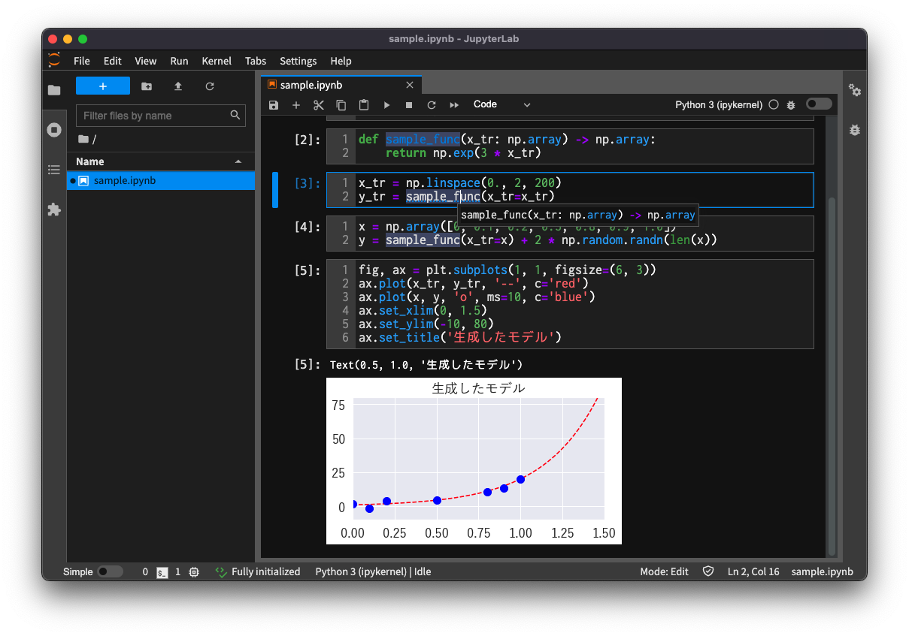

# JupyterLab on pipx & Yet Another JupyterLab App

Yet Another JupyterLab App: The simplest desktop application only for [JupyterLab](https://github.com/jupyterlab/jupyterlab), based on [Electron](https://www.electronjs.org/)

## Motivation for create original app for JupyterLab

As you know, [JupyterLab App](https://github.com/jupyterlab/jupyterlab_app) is the awesome desktop application for JupyterLab, developed by [Project Jupyer](https://jupyter.org/).

[JupyterLab App](https://github.com/jupyterlab/jupyterlab_app) contains the desktop application (JupyterLab client) based on Electron and Python virtual environment (venv) with the JupyterLab server.

But it is too much for me. I want to run the JupyterLab server on my own venv. I just need a simple application which only access to `http://localhost:8888/lab`.

On the other hand, [Electron](https://www.electronjs.org/) provides a great sample implementation: [electron-quick-start](https://github.com/electron/electron-quick-start). It is a simple desktop application that only displays `index.html` with `electron.BrowserWindow().loadFile('index.html')`.

That is very close to what I'm looking for. The app I need is doing `electron.BrowserWindow().loadURL('http://localhost:8888/lab')` instead of `loadFile()`.

So, I made it.

## Necessities

* [Node.js](https://nodejs.org/)
    * nodenv and its plugins are installed in [zsh](/zsh/)
    * Install Node.js with nodenv and set it as global use
        * `> nodenv install --list`
        * `> nodenv install x.x.x`
        * `> nodenv global x.x.x`
* [yarn](https://yarnpkg.com/)
    * `> npm install -g yarn`
        * `npm` is automatically installed when you install Node.js
        * Don't forget to add `-g` option
* pipx
    * pipx is installed in [zsh](/zsh/)

## What this does

* install jq (if it has not been installed)
* install jupyterlab and packages with pipx (if they have not been installed)
    * packages: python-lsp-server[all], jupyterlab-lsp
* create symbolic links of client config file
    * `user-settings` -> `~/.jupyter/lab/user-settings`
* create symbolic link of server config file
    * `jupyter_lab_config.py.linux` / `jupyter_lab_config.py.macos` -> `${pipx_jupyterlab_etc}/jupyter_lab_config.py`
* build and install app (if it has not been installed)

## What to do

* `> ./install.sh`

## OSs confirmed that the app works

* Mac OSX: Mac OSX 11.6 (Big Sur)
* Linux: Ubuntu 21.04 (Hirsute Hippo) kernel 5.11.0-37-generic

## Use the JupyterLab with the app

* go to project directory
* Run the JupyterLab
    * `> jupyter-lab`
